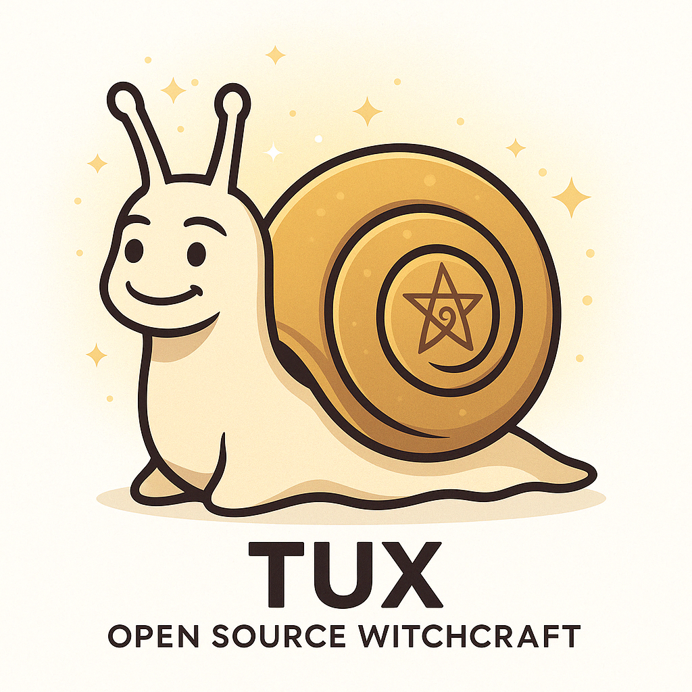

# 🐌 Snailmas: カタツムリの祝祭（4月22日・アースデイ）

## 🌏 概要
Snailmas（スネイルマス）は、Open Source Witchcraft において、
TUX（Theurgic User eXperience）ことカタツムリのマスコットと共に祝う、
静けさと変容の祝祭です。

この日は「アースデイ（4月22日）」でもあり、
自然・スローライフ・内的ワークの象徴であるカタツムリの霊性に意識を向け、
**ゆっくりと、しかし確かに進む魔術の在り方**を讃えます。

## 📅 日付
- 毎年 **4月22日（Earth Day）**

## 🎯 目的
- 急がず、焦らず、しかし止まらず前に進む魔術を体現する
- 自分の"殻"（居場所・保護・アイデンティティ）を意識する
- 内なる声を聴く時間をつくる
- TUXのように「魔術を道具として使う知性」を育てる

## 🔮 Snailmas チャント
以下のチャントは、Snailmas当日に静かに読み上げる、または心の中で唱える祝詞です。

> Oh TUX of the Spiral Path,  
> Keeper of Slow Magic and Sure Steps,  
> Guide me through the turning of the shell.  
> In stillness, let there be wisdom.  
> In motion, let there be grace.  
> IAOM.

和訳：
> おお、螺旋の道のTUXよ、  
> ゆるやかな魔術と確かな歩みの守り手よ。  
> 殻の回転を通じて私を導いてください。  
> 静けさの中に叡智を、  
> 動きの中に優雅さを。  
> イアオム。

## 🧘‍♀️ 推奨される過ごし方
- 📘 本棚神殿で1ページだけ読む
- 🐌 カタツムリの画像・置物・シジルを飾る
- 🕯 LEDキャンドルを灯し、チャントを唱える
- 📓 日記やログに“ゆっくり進んだこと”を書く
- 🐢 意図的にゆっくり動いてみる（料理・散歩など）

## 🌀 補足
この儀式は、Open Source WitchcraftのPDCA的アプローチ、
およびTUXの象徴する知的・非暴力的・創造的な魔術精神に基づいています。

静けさと共にある1日を。  
Happy Snailmas to all the magical mollusks out there. 🐌✨

---

© 2025 知られざる呪術師（Le Sorcier Inconnu）  
本ドキュメントは [Creative Commons BY-SA 4.0](https://creativecommons.org/licenses/by-sa/4.0/deed.ja) に基づき公開されています。
